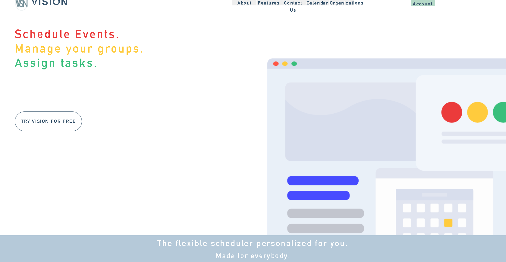
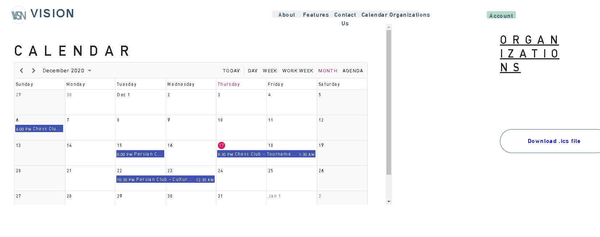
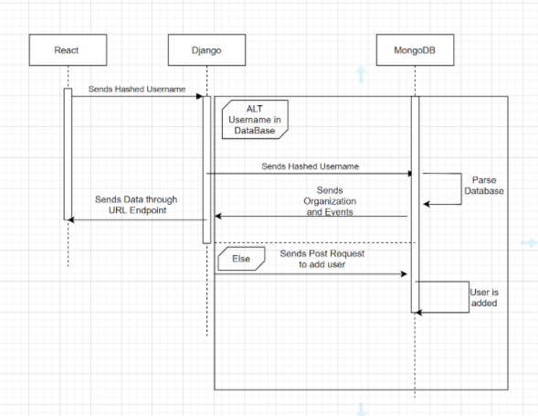
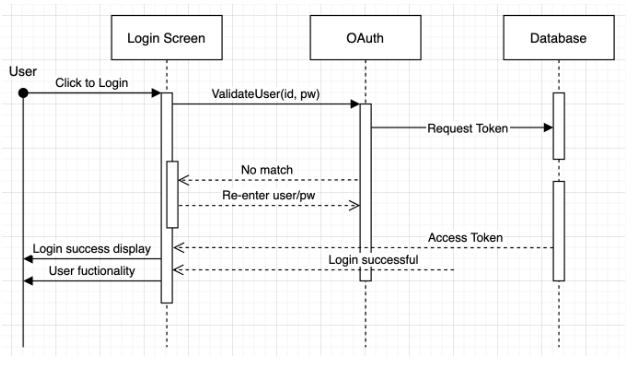

# CS178A-B-Template

## Table of Contents
- [Overview](#overview)
- [Usage](#usage)
- [How To Run](#how-to-run)
- [Diagrams](#diagrams)
- [Dependencies](#dependencies)

## Overview
With so many organizations, meetings, and events to keep track of, there can only be so much
that can be incorporated into a person’s schedule. This can extend to their academics,
extracurriculars, and even personal lives. Typically, someone would keep track of their schedule
via Google calendar, but adding events individually and delegating tasks between their day. On
another hand, most of the information surrounding events, meetings, and practices lie hidden in
separate discord pages, unread facebook announcements, and disregarded emails. Our Flexible
Scheduler and Task Distributor Project is a web application that will allow people, generally
students, to arrange their extracurriculars in one place and arrange tasks in a todo-list style.

## Team
<a href="https://github.com/vishshukla" target="_blank">Vishwas Shukla </a>
<a href="https://github.com/VirajDhillon" target="_blank">Viraj Dhillon </a>
<a href="https://github.com/nicohhle" target="_blank">Nicole Nguyen </a>
<a href="https://github.com/Sherv24" target="_blank">Sherwin Sahebi </a>

## Usage
Live Site: https://team-vision-cs178.herokuapp.com/

## How To Run
In the project directory, you can run:

### `yarn install`

Gets dependencies for the application. 

### `yarn start`
Runs the app in the development mode. This runs the front-end only.  
Open [http://localhost:3000](http://localhost:3000) to view it in the browser.

The page will reload if you make edits. 
You will also see any lint errors in the console.

### `python manage.py runserver`

This runs the back-end. API requests should work now (getCalendarInfo, Organizations, etc...)

### `yarn build`

Builds the app for production to the `build` folder. 
You can use the entire application in `localhost:8000`.
It correctly bundles React in production mode and optimizes the build for the best performance.

The build is minified and the filenames include the hashes. 

## Diagrams

Overall System Diagram

## Dependencies
Install Node Package Manager (npm). [Helpful Documentation](https://www.npmjs.com/get-npm)

